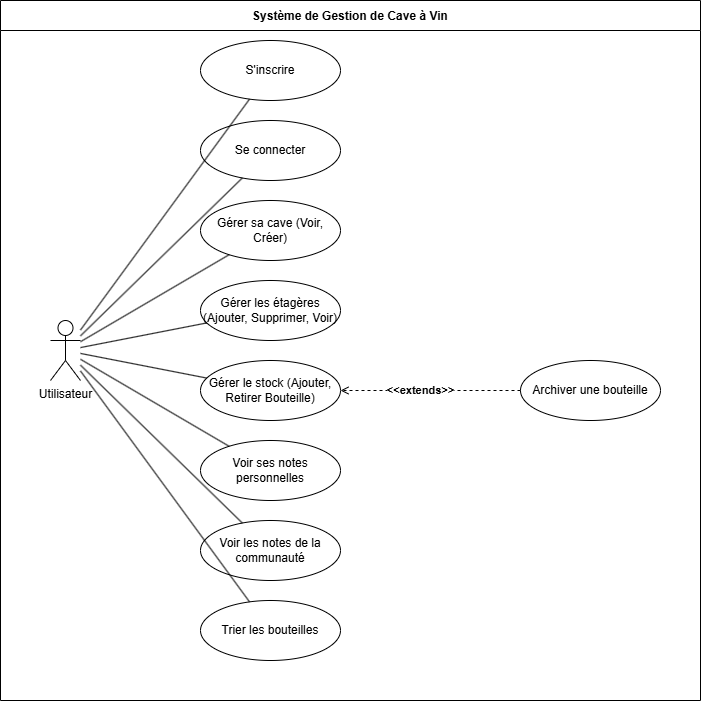

# Gestion de Cave à Vin - Projet ETRS711

Projet réalisé pour le module **ETRS711 - Conception et Programmation Orientée Objet**.

Cette application web permet à plusieurs utilisateurs de gérer leur cave à vin personnelle. Ils peuvent créer une cave virtuelle, y ajouter des bouteilles, les organiser sur des étagères, et les noter.

## Fonctionnalités Implémentées 

* **Gestion de comptes utilisateurs** : Création de compte et connexion sécurisée.
* **Gestion de la cave** : Chaque utilisateur peut créer sa cave virtuelle.
* **Gestion des étagères** : Ajout et suppression d'étagères avec nom et capacité paramétrable.
* **Gestion du stock** : Ajout de bouteilles (issues d'une liste prédéfinie) sur une étagère, en respectant la capacité. Gestion des quantités pour les bouteilles identiques.
* **Retrait et Archivage** :
    * Retirer une bouteille (-1 du stock).
    * Archiver une bouteille (-1 du stock ET ajout d'une note personnelle avec commentaire).
* **Visualisation Personnelle** : Affichage de la cave avec les étagères, les bouteilles stockées (quantité, détails), et les notes personnelles de l'utilisateur.
* **Tri des bouteilles** : Tri des bouteilles dans la cave par Nom (A-Z, Z-A), Année (récent/ancien), ou Prix (cher/moins cher).
* **Notes Communautaires** :
    * Affichage d'une page dédiée avec toutes les notes et commentaires laissés par tous les utilisateurs.
    * Calcul et affichage de la **note moyenne** de la communauté pour chaque type de bouteille (visible dans la cave et sur la page des notes).
* **Interface Web** : Utilisation de Flask pour le backend, HTML/CSS pour le frontend.
* **Persistance des données** : Base de données SQLite pour stocker les informations.

## Technologies Utilisées 

* **Langage** : Python 3
* **Framework Web** : Flask
* **Base de Données** : SQLite
* **Frontend** : HTML, CSS
* **Conception** : UML (Mermaid Syntax)

## Conception UML 

<h1 align="center">Diagramme de Cas d'Utilisation</h1>

