# Gestion de Cave à Vin - Projet ETRS711

Projet réalisé pour le module **ETRS711 - Conception et Programmation Orientée Objet**.

Cette application web permet à plusieurs utilisateurs de gérer leur cave à vin personnelle. Ils peuvent créer une cave virtuelle, y ajouter des bouteilles, les organiser sur des étagères, et les noter.

## Fonctionnalités Implémentées ✅

* **Gestion de comptes utilisateurs** : Création de compte et connexion sécurisée.
* **Gestion de la cave** : Chaque utilisateur peut créer sa cave virtuelle.
* **Gestion des étagères** : Ajout et suppression d'étagères avec nom et capacité paramétrable.
* **Gestion du stock** : Ajout de bouteilles (issues d'une liste prédéfinie) sur une étagère, en respectant la capacité. Gestion des quantités pour les bouteilles identiques.
* **Retrait et Archivage** :
    * Retirer une bouteille (-1 du stock).
    * Archiver une bouteille (-1 du stock ET ajout d'une note personnelle avec commentaire).
* **Visualisation Personnelle** : Affichage de la cave avec les étagères, les bouteilles stockées (quantité, détails), et les notes personnelles de l'utilisateur.
* **Tri des bouteilles** : Tri des bouteilles dans la cave par Nom (A-Z, Z-A), Année (récent/ancien), ou Prix (cher/moins cher).
* **Notes Communautaires** :
    * Affichage d'une page dédiée avec toutes les notes et commentaires laissés par tous les utilisateurs.
    * Calcul et affichage de la **note moyenne** de la communauté pour chaque type de bouteille (visible dans la cave et sur la page des notes).
* **Interface Web** : Utilisation de Flask pour le backend, HTML/CSS pour le frontend.
* **Persistance des données** : Base de données SQLite pour stocker les informations.

## Technologies Utilisées 💻

* **Langage** : Python 3
* **Framework Web** : Flask
* **Base de Données** : SQLite
* **Frontend** : HTML, CSS
* **Conception** : UML (Mermaid Syntax)

## Conception UML 📊

*(Ces diagrammes sont écrits en syntaxe Mermaid. Ils sont rendus visuellement par GitHub)*

### Diagramme de Cas d'Utilisation

```mermaid
graph TD
    subgraph "Système Gestion Cave"
        UC1[S'inscrire]
        UC2[Se connecter]
        UC3[Gérer sa cave\n(Voir, Créer)]
        UC4[Gérer les étagères\n(Ajouter, Supprimer, Voir)]
        UC5[Gérer le stock\n(Ajouter, Retirer Bouteille)]
        UC6[Archiver une bouteille]
        UC7[Voir ses notes personnelles]
        UC8[Voir les notes de la communauté]
        UC9[Trier les bouteilles]
    end

    Utilisateur --|> UC1
    Utilisateur --|> UC2
    Utilisateur --|> UC3
    Utilisateur --|> UC4
    Utilisateur --|> UC5
    Utilisateur --|> UC6
    Utilisateur --|> UC7
    Utilisateur --|> UC8
    Utilisateur --|> UC9

    UC6 ..> UC5 : <<extends>>

    style Utilisateur fill:#f9f,stroke:#333,stroke-width:2px
```

### Diagramme de Classes

```mermaid
classDiagram
    class Utilisateurs {
        -id_utilisateur: int
        -nom: str
        -prenom: str
        -identifiant: str
        -mdp: str
        +voir_cave(sort_by)
        +voir_notes()
        +cave_exist()
        +ajouter_utilisateur()
        +connexion()
    }

    class Bouteilles {
        -id_bouteille: int
        -domaine_viticole: str
        -nom: str
        -type_bouteilles: str
        -annee: int
        -region: str
        -photo: str
        -prix: float
        +ajoute_bouteille()
    }

    class Etageres {
        -id_Etagere: int
        -nom: str
        -capacite: int
        -id_utilisateur: int
        +creer_etagere()
        +supprimer_etagere()
        +ajouter_bouteille_stock(id_etagere, id_bouteille, quantite)
        +retirer_bouteille_stock(id_etagere, id_bouteille, quantite)
    }

    class Cave {
        -id_utilisateur: int
        -id_etagere: int
        +cree_cave()
        +associe_etagere(id_etagere)
    }

    class Notes {
        -id_utilisateur: int
        -id_bouteille: int
        -notes: float
        -commentaires: str
        -id_commentaires: int
        +ajouter_note()
        +voir_toutes_les_notes()* static
        +calculer_note_moyenne(id_bouteille)* static
    }

    class StockEtagere {
      <<Association Class>>
      -id_etagere: int
      -id_bouteille: int
      -quantite: int
    }
    
    class Database {
        -conn: Connection
        +create_tables()
        +fin_connexion()
    }

    Utilisateurs "1" -- "*" Cave : possède
    Cave "*" -- "*" Etageres : contient (via table Cave)
    Utilisateurs "*" -- "*" Notes : écrit
    Bouteilles "*" -- "*" Notes : reçoit note
    Etageres "*" -- "*" Bouteilles : contient (via StockEtagere)
    (Etageres, Bouteilles) .. StockEtagere

```

### Diagrammes de Séquence

**1. Séquence : Ajouter une bouteille à une étagère**

```mermaid
sequenceDiagram
    participant U as Utilisateur
    participant C as /cave (site_html.py)
    participant E as Etageres (class711.py)
    participant DB as Database (Cave.db)

    U->>C: POST /cave (action=ajouter_bouteille, id_etagere, id_bouteille, quantite)
    C->>E: ajouter_bouteille_stock(id_e, id_b, q)
    E->>DB: SELECT capacite FROM Etageres WHERE id_Etagere=?
    DB-->>E: capacite_max
    E->>DB: SELECT SUM(quantite) FROM StockEtagere WHERE id_etagere=?
    DB-->>E: stock_actuel
    alt Capacité suffisante
        E->>DB: SELECT quantite FROM StockEtagere WHERE id_etagere=? AND id_bouteille=?
        DB-->>E: bouteille_existante
        alt Bouteille existe déjà
            E->>DB: UPDATE StockEtagere SET quantite=...
        else Bouteille nouvelle
            E->>DB: INSERT INTO StockEtagere VALUES (...)
        end
        DB-->>E: Success
        E-->>C: (True, Message Succès)
    else Capacité insuffisante
        E-->>C: (False, Message Erreur Capacité)
    end
    C->>U: Redirect to /cave with Flash Message
```



**2. Séquence : Archiver une bouteille**

```mermaid
sequenceDiagram
    participant U as Utilisateur
    participant C as /cave (site_html.py)
    participant E as Etageres (class711.py)
    participant N as Notes (class711.py)
    participant DB as Database (Cave.db)

    U->>C: POST /cave (action=archiver_bouteille, id_etagere, id_bouteille, note, commentaire)
    C->>E: retirer_bouteille_stock(id_e, id_b, 1)
    E->>DB: SELECT quantite FROM StockEtagere WHERE id_etagere=? AND id_bouteille=?
    DB-->>E: stock_actuel
    alt Stock suffisant (>=1)
        alt Stock == 1
            E->>DB: DELETE FROM StockEtagere WHERE ...
        else Stock > 1
            E->>DB: UPDATE StockEtagere SET quantite = quantite - 1 WHERE ...
        end
        DB-->>E: Success
        E-->>C: (True, Message Retrait Succès)
        C->>N: creer instance Notes(user_id, bouteille_id, note, commentaire)
        C->>N: ajouter_note()
        N->>DB: INSERT INTO Notes (...) VALUES (...)
        DB-->>N: Success
        N-->>C: (True, Message Archivage Succès)
    else Stock insuffisant (0)
         E-->>C: (False, Message Erreur Stock)
    end
    C->>U: Redirect to /cave with Flash Messages (Retrait + Archivage)
```


